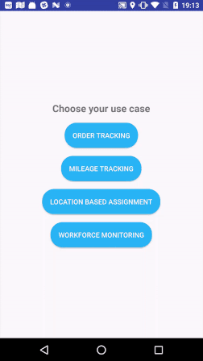

# Hyper Track Use Cases Example Android app

This open source repo uses HyperTrack to enable following four use cases: 
1. **Order Tracking**: Build order tracking views in your product experience and business dashboards.
2. **Workforce Monitoring**: Build workforce monitoring of your fleet to power operational efficiencies.
3. **Mileage Tracking**: Build automatic mileage tracking for expense management of sales and service teams.
4. **Location-based Assignments**: Build location-based assignments for your on-demand business.

## Requirements
1. [Android Studio](https://developer.android.com/studio/index.html) with emulator (or test device)
2. HyperTrack API keys. Learn more about them [here](https://docs.hypertrack.com/gettingstarted/authentication.html), and sign up for them [here](https://dashboard.hypertrack.com/signup).

## Usage:

The example application implements tracking a User in the background as well as tracking a User on an Action. Read our [introduction](https://docs.hypertrack.com/) to know more.

Recommended: Take a look at the Android [documentation](https://docs.hypertrack.com/sdks/android/setup.html).

**STEPS**

1. Sync the Gradle files to download the HyperTrack SDKs.
2. Replace `YOUR_PUBLISHABLE_KEY_HERE` with your Hypertrack API key in `UseCaseApplication.java` [here](https://github.com/hypertrack/use-cases-example-android/blob/master/app/src/main/java/io/hypertrack/usecases/UseCaseApplication.java#L20).
3. Run in emulator or directly on a phone either by connecting to your computer or by creating an APK and then installing it manually. You might need to enable the location permission: see [how](readme-imgs/location.gif). You also will need to follow [these steps](https://developer.android.com/studio/run/emulator.html#extended) for the emulator.
4. Select your Use Case and login.
4. Once you assign an Action on the app you will see that appear on the [Dashboard](https://dashboard.hypertrack.com/live/actions). You will also be able to view a replay of the user's travels.

## Documentation
For detailed documentation of the methods and customizations, please visit the official [docs](https://docs.hypertrack.com/).

## Contribute
Please use the [issues tracker](https://github.com/hypertrack/example-android/issues) to raise bug reports and feature requests. We'd love to see your pull requests - send them in!

## Support
Join our [Slack community](http://slack.hypertrack.com) for instant responses, or interact with our growing [Community](https://community.hypertrack.com). You can also email us at help@hypertrack.com.

# trucktrack
